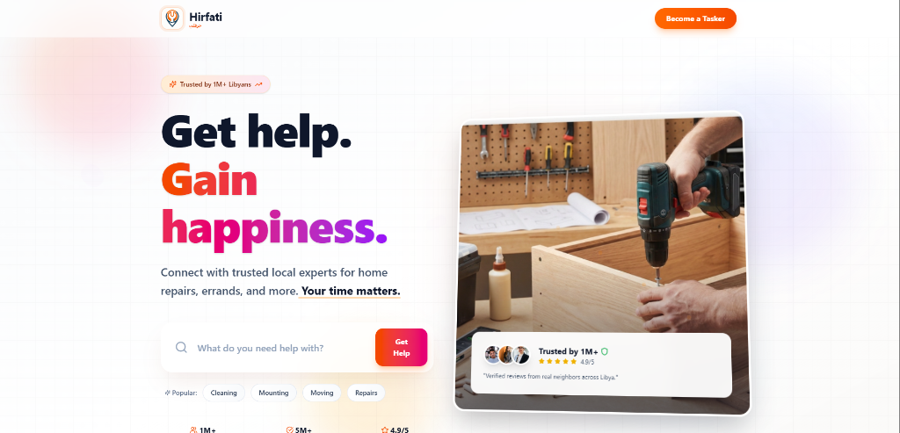
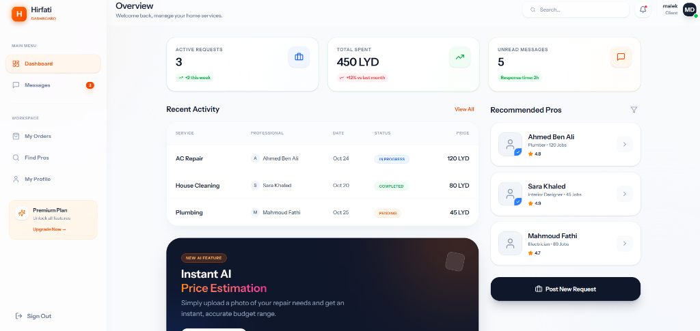
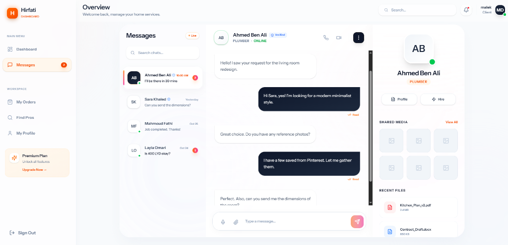

# Hirfati (حرفتي)

<div align="center">
  
  <br>
  <h1>The Premier Home Services Marketplace in Libya</h1>
  <p>
    <b>Connect with trusted local experts for home repairs, errands, and more.</b>
  </p>
  <p>
    <a href="#features">Features</a> •
    <a href="#tech-stack">Tech Stack</a> •
    <a href="#infrastructure">Infrastructure</a> •
    <a href="#installation">Installation</a>
  </p>
</div>

---

## 📖 Overview

**Hirfati** serves as a bridge between homeowners and skilled professionals. Whether you need a plumber, electrician, or a general handyman, Hirfati makes it effortless to find, hire, and pay trusted professionals. Our platform is built with a focus on **speed, security, and user experience**.

## 📸 Screenshots

<div align="center">
  <h3>Smart Dashboard</h3>
  
  <br><br>
  <h3>Real-time Communication</h3>
  
</div>

---

## ✨ Key Features

Hirfati comes packed with state-of-the-art features designed to provide a seamless experience for both Clients and Taskers:

### 🤖 AI & Automation
- **Instant AI Price Estimation**: Upload a photo of your repair needs, and our Computer Vision model (Hirfati Vision API) will generate an accurate budget range instantly.
- **Smart Matching Algorithm**: Automatically pairs clients with the best-rated professionals nearby based on skill, availability, and rating.

### Is Security & Trust
- **Verified Pros**: Identity verification system linked to national ID databases.
- **Secure Escrow Payments**: Funds are held safely until the job is completed to satisfaction.
- **Automated Dispute Resolution**: AI-driven mediation system to resolve common conflicts fairly.

### ⚡ Performance & Experience
- **Real-Time Tracking**: Track your professional's arrival in real-time on the map.
- **Multi-Platform Support**: Fully responsive design with PWA capabilities for offline access.
- **Bilingual Interface**: Seamless switching between Arabic and English.

---

## 🛠 Tech Stack

The application is built using a robust, modern stack to ensure scalability and performance:

- **Frontend**: React.js, Inertia.js, Tailwind CSS
- **Backend**: Laravel 11, PHP 8.3
- **Database**: PostgreSQL / Redis (for caching & queues)
- **Real-time**: Laravel Reverb (WebSockets)

---

## ☁️ Infrastructure & DevOps

We utilize enterprise-grade infrastructure to guarantee 99.9% uptime and security:

###   AWS (Amazon Web Services)
- **EC2 Auto Scaling**: Automatically adjusts capacity to maintain steady, predictable performance at the lowest possible cost.
- **S3 & CloudFront**: Secure storage and global content delivery for user-generated content and assets.
- **RDS**: Managed relational database service with automated backups and high availability.

###   Docker
- **Containerization**: The entire application is containerized using Docker, ensuring consistency across development, staging, and production environments.
- **Microservices Architecture**: Critical services like the AI Pricing Engine and Notification System run as isolated containers for better maintainability.

---

## 🚀 Installation

To run this project locally:

1. **Clone the repository**
   ```bash
   git clone https://github.com/your-org/hirfati.git
   cd hirfati
   ```

2. **Start with Docker (Recommended)**
   ```bash
   docker-compose up -d
   ```

3. **Or Manual Setup**
   ```bash
   composer install
   npm install
   cp .env.example .env
   php artisan key:generate
   php artisan migrate --seed
   npm run dev
   ```

---

<div align="center">
  <p>Made with ❤️ for Libya</p>
</div>
